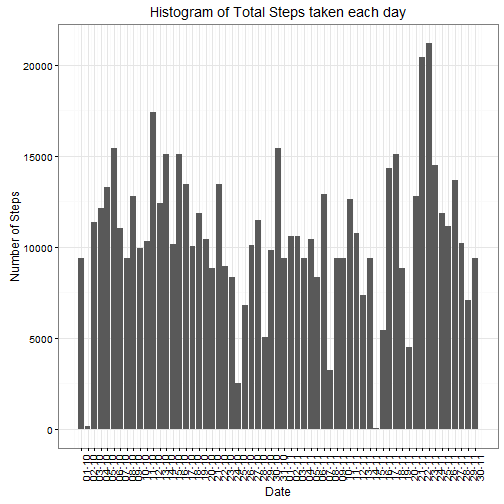

## Loading and preprocessing the data
We load the data and then remove the NA's with 0's and then find the total steps taken each each day. Also, we make the date variable as factor.

```r
# Reading the data from the csv file
act <- read.csv("activity.csv", header = TRUE,sep=",")

# Replacing the na values as 0
act[is.na(act)] <- 0

# Calculating the total steps taken each day
step_day <- aggregate(steps ~ date, act, sum)
step_day$date <- as.Date(step_day$date)
```

## What is mean total number of steps taken per day?
The code below plots a graph of total steps taken each day

```r
# Plotting a histogram of the total steps taken on each day
ggplot(step_day,aes(date,steps)) + geom_bar(stat = "identity") + 
    labs(title = "Histogram of Total Steps taken each day" , x = "Date", y = "Number of Steps") + 
    theme_bw() + theme(axis.text.x = element_text(angle=90)) + 
    scale_x_date(breaks = step_day$date , labels =date_format("%d-%m"))
```


The mean and median number of steps taken each day is given by

```r
# Finding the average number of steps taken each day
mean_day <- aggregate(steps ~ date, act, mean)
# Finding the median number of steps taken each day
median_day <- aggregate(steps ~ date, act, median)
```

## What is the average daily activity pattern?
To find out the average daily activity pattern, we find the mean steps taken for each interval and then plot a time-series graph.

```r
# Finding the average steps withing each 5 minute interval
interval_step <- aggregate(steps ~ interval, act, mean)

# Plotting the time series plot.
ggplot(interval_step, aes(interval,steps)) + geom_line() + 
    labs(title="Time Series Plot", x = "Interval", y = "Average Steps taken")
```


The maximum number of steps taken in an interval is given by

```r
# Finding the interval with the max average number of steps taken
interval_step[interval_step$interval == max(interval_step$interval),]
```

```
##     interval     steps
## 288     2355 0.9344262
```

## Imputing missing values
Initially, we replaced the NA's with 0, but here we are replacing the NA with the mean for the interval in which it is present. 
So, first we will find the number of rows with NA's

```r
# Finding the number of rows with NA's
with_na <- read.csv("activity.csv", header = TRUE,sep=",")
sum(is.na(with_na))
```

```
## [1] 2304
```
Now we will replace these rows with the mean for that interval

```r
# Replacing all NA with the average steps taken in that interval
for( i in 1:nrow(with_na)){
    if(is.na(with_na$steps[i])){
        with_na$steps <- interval_step[which(with_na$interval[i]==interval_step$interval),]$steps
    }
}
```
Now were plotting the same graph that we initally plotted with NA's as 0.

```r
# Calculating the total steps taken each day(modified)
modified_data <- aggregate(steps ~ date, with_na, sum)
modified_data$date <- as.Date(modified_data$date)

# Plotting a histogram of the total steps taken on each day
ggplot(modified_data,aes(date,steps)) + geom_bar(stat = "identity") + 
labs(title = "Histogram of Total Steps taken each day" , x = "Date", y = "Number of Steps") + 
theme_bw() + theme(axis.text.x = element_text(angle=90)) + 
scale_x_date(breaks = modified_data$date , labels =date_format("%d-%m"))
```


Also, we will find the mean and median steps taken each day

```r
# Finding the average number of steps taken each day
modified_mean <- aggregate(steps ~ date, with_na, mean)
# Finding the median number of steps taken each day
modified_meidan <- aggregate(steps ~ date, with_na, median)
```

## Are there differences in activity patterns between weekdays and weekends?
First, we convert the date variable into the weekday that it represents.

```r
# Making the date variable as factor
with_na$date <- as.Date(with_na)
```

```
## Error in as.Date.default(with_na): do not know how to convert 'with_na' to class "Date"
```

```r
# Adding a new column which will have the weekday
with_na$weekday <- weekdays(with_na$date)
```

```
## Error in UseMethod("weekdays"): no applicable method for 'weekdays' applied to an object of class "factor"
```
Now, we classify the weekdays into weekday or weekend.

```r
for(i in 1:nrow(with_na)){
if(with_na[i,]$weekday %in% c("Monday", "Tuesday", "Wednesday","Thursday","Friday")){
with_na[i,]$weekday <- "Weekday"
}
else
with_na[i,]$weekday <- "Weekend"
}
```

```
## Error in if (with_na[i, ]$weekday %in% c("Monday", "Tuesday", "Wednesday", : argument is of length zero
```

```r
# Making the weekday variable as factor
with_na$weekday <- as.factor(with_na$weekday)
```

```
## Error in `$<-.data.frame`(`*tmp*`, "weekday", value = structure(integer(0), .Label = character(0), class = "factor")): replacement has 0 rows, data has 17568
```
Finally plotting a graph that shows the steps taken on weekday's and weekend's against the interval

```r
# Finding the average steps based on the intervals
int_steps <- aggregate(steps~interval+weekday,d,mean)

# Plotting the panel plot of number of steps in each interval 
# factored by weekdays and weekends
ggplot(int_steps,aes(interval,steps)) + geom_line() + facet_grid(weekday ~ .) 
```


```r
+ labs(title = "Steps taken averaged over weekdays and weekends", 
x = "Interval" , 
y = "Number of Steps")
```

```
## Error in +labs(title = "Steps taken averaged over weekdays and weekends", : invalid argument to unary operator
```
